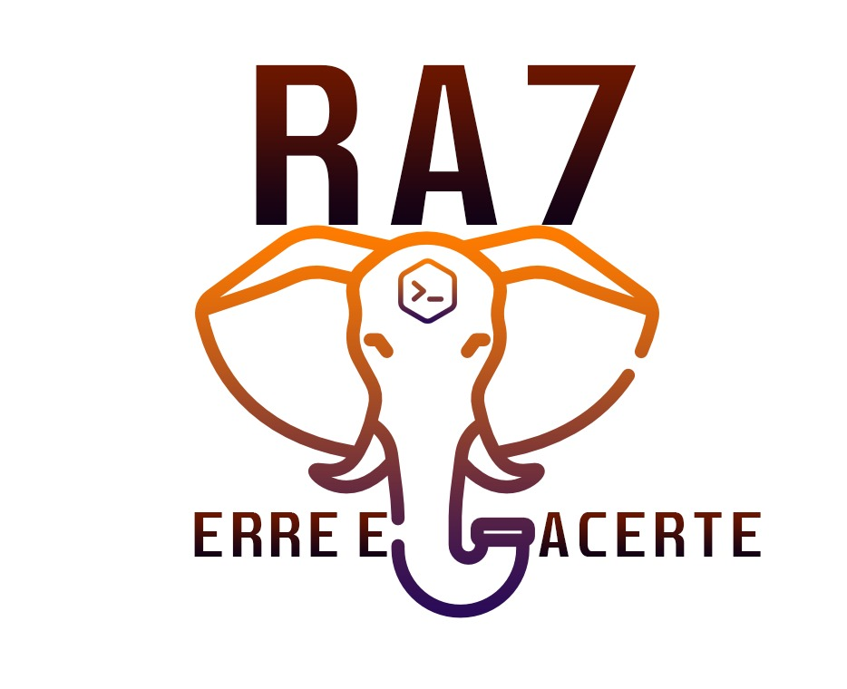

# Desafio de Projetos

###### PS Visão Jr 2021

  

# Descrição

Aplicação desenvolvida durante o desafio de projetos para o processo seletivo [Visão Jr](https://www.visaojr.com.br/) 2021.

A aplicação consiste em uma página para a empresa fictícia criada durante o desafio de presidência, que nesse caso se chama [Petshop Galac](https://petshop-galac.herokuapp.com). Um petshop que presta serviços de banho, tosa, consultas, vacinação, além de um ambiente que prioriza o bem-estar de seu animalzinho de estimação.

# Equipe

* [Ana Júlia Alves](https://github.com/AnaJuliaAlvess)
* [Arthur Germano](https://github.com/germano-beep)
* [Caio Felício](https://github.com/caiofelicio)
* [Giuliane Correa](https://github.com/GiulianeEC)
* [Luiza Borges](https://github.com/lubpolita)

